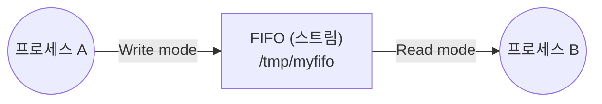

# 8장 프로세스간 통신 (IPC) — 8.2 FIFO (Named Pipe)

## 1. 파이프 vs FIFO

| 구분 | 통신 대상 | 접근 방식 |
|------|----------|----------|
| **파이프 (Pipe)** | **부모-자식 관계** 프로세스만 (fork()로 생성된 프로세스 사이) | 디스크립터 상속 |
| **FIFO (Named Pipe)** | **가족 관계가 아닌 임의의 프로세스**도 가능 | **파일 이름**으로 접근 |

- FIFO = 파이프에 **이름을 지정**한 것 (Named pipe)
- 가족 관계가 아닌 다른 프로세스도 이 이름을 통해 파이프에 접근 가능

---

## 2. FIFO 생성 — `mkfifo()`

```c
int mkfifo(const char *pathname, mode_t mode);
```

- `pathname` : 파이프(FIFO)의 **이름(경로)** 지정
  - 경로명 없이 이름만 주면 → **현재 디렉토리**에 FIFO 생성
- `mode` : 생성되는 FIFO의 **파일 접근 권한** 설정

### 권한(mode) 읽는 법
```
0 6 6 0
│ │ │ └─ 모든 사용자/그룹(other)
│ │ └─── 파일이 속한 그룹(group)
│ └───── 소유자(owner)
└─────── 0 = 일반 파일/FIFO (digit이 0이면 directory 아님)

각 자리: r(4) w(2) x(1) 의 합
6 = rw- (읽기+쓰기)
```

> **0660 예시**: 자신(소유자)과 그룹 사용자에게 **읽기·쓰기** 권한 부여,
> 그 외 사용자는 **제외**

---

## 3. FIFO 사용

- FIFO를 생성한 후 읽거나 쓰려면 **`open()`** 해야 함
- 파이프의 일종으로 프로세스 간 **스트림(stream) 채널** 형성
- 파이프와 다른 점은 단 하나 → **파일 이름으로 액세스 가능**



---

## 4. FIFO를 이용한 UDP 에코 서버 (`udpserv_fifoecho.c`)

| 프로세스 | 역할 |
|---------|------|
| 부모 | 클라이언트로부터 받은 메시지를 **FIFO에 쓰기** |
| 자식 | FIFO로부터 데이터를 **읽어 클라이언트로 에코** |

- **FIFO의 이름만 알고 있으면** 언제든지 `open()`하여 사용 가능
- (비교) 파이프는 `fork()` **하기 전에** 파이프를 먼저 생성해야 함

---

## 핵심 요약

1. 파이프 = 부모-자식만 / FIFO = **이름**으로 임의의 프로세스끼리 통신
2. FIFO 생성: `mkfifo(pathname, mode)` → 사용 전 `open()` 필요
3. FIFO도 **단방향 스트림 채널**, 차이는 "파일 이름으로 접근" 뿐
4. mode `0660` = 소유자·그룹 읽기/쓰기, 그 외 제외
5. FIFO는 이름만 알면 언제든 open 가능 / 파이프는 fork 전에 미리 생성
